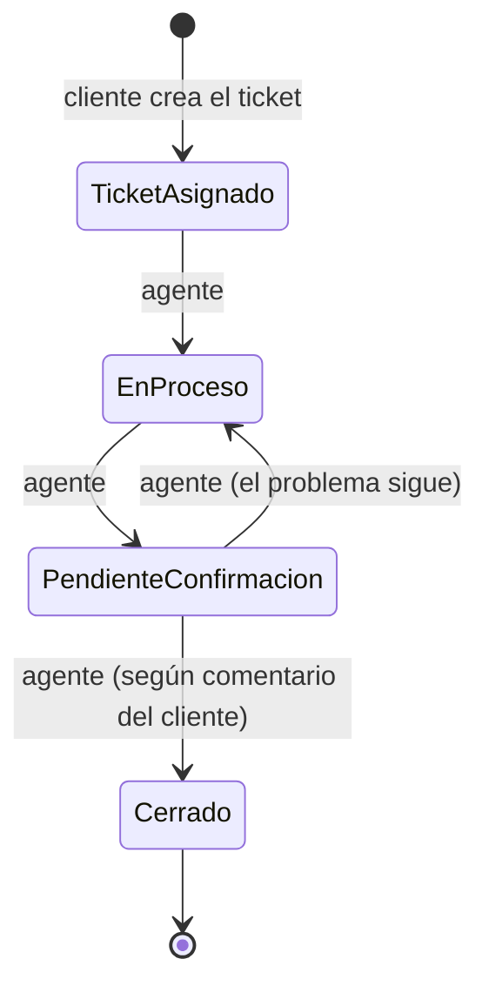

# Alcance simplificado — Sistema de Gestión de Tickets de Soporte

> **Estado:** borrador para que lo apruebe el grupo.
> Este documento reemplaza el alcance anterior. Es un proyecto **con fines educativos**: no es un sistema real, así que priorizamos que sea simple por sobre que sea completo.

---

## 1. Criterios generales

- **Sin inicio de sesión.** El sistema no tiene login, contraseñas ni pantalla de ingreso. Todos entran directo a la interfaz principal, sin importar el rol. No se agrega login más adelante.
- **Identificación por DNI.** Cuando una función necesita saber quién es el cliente, se le pide el DNI.
- **Validaciones mínimas.** Solo se controla que los campos obligatorios estén completos. Si el sistema permite situaciones que en un sistema real no deberían pasar (por ejemplo, que un agente cambie un ticket de cualquier estado a cualquier otro), **se acepta**.

---

## 2. Actores

| Actor | Qué puede hacer |
|---|---|
| **Cliente** | Crear un ticket con su DNI, consultar sus tickets y escribir un comentario |
| **Agente de soporte** | Ver los tickets que tiene asignados y cambiarles el estado |

---

## 3. Estados del ticket

| # | Estado | Significado |
|---|---|---|
| 1 | **Ticket asignado** | Recién creado; el sistema ya le asignó un agente |
| 2 | **En proceso** | El agente está trabajando en el problema |
| 3 | **Pendiente de confirmación** | El agente cree que está resuelto y espera que el cliente lo confirme |
| 4 | **Cerrado** | Caso terminado |

> El diagrama muestra el camino esperado. Como no validamos transiciones, el agente puede pasar el ticket a cualquier estado.

---

## 4. Flujo principal

1. El **cliente** crea un ticket ingresando su **DNI**, asunto, descripción y categoría.
2. El sistema le **asigna un agente al azar** y lo deja en estado **Ticket asignado**.
3. El **agente** va cambiando el estado a medida que trabaja.
4. El **cliente** puede escribir un **comentario**. Cada comentario nuevo **reemplaza al anterior** (no hay historial).
5. El **agente** lee el comentario y cambia el estado en base a eso (por ejemplo, de *Pendiente de confirmación* a *Cerrado*).

---

## 5. Modelo de datos (2 tablas)

### `agente`

| Campo | Tipo | Notas |
|---|---|---|
| `id` | entero | PK |
| `nombre` | texto | |

### `ticket`

| Campo | Tipo | Notas |
|---|---|---|
| `id` | entero | PK |
| `dni_cliente` | texto | Obligatorio. No hay tabla de clientes |
| `asunto` | texto | Obligatorio |
| `descripcion` | texto | Obligatorio |
| `categoria` | texto | Valor de una lista fija (ver abajo) |
| `estado` | texto | Uno de los 4 estados |
| `comentario` | texto | Nulo al crear; se pisa con cada comentario nuevo |
| `fecha_creacion` | fecha y hora | La pone el sistema |
| `agente_id` | entero | FK a `agente.id`; se asigna al azar al crear |

**Relación:** un agente tiene muchos tickets; cada ticket tiene un solo agente (1:N).

### Categorías (lista fija)

`Conexión` · `Facturación` · `Consulta general` · `Otro`

> Propuesta: el grupo puede cambiar los valores.

---

## 6. Qué sacamos respecto de la versión anterior

| Eliminado | Motivo |
|---|---|
| Login / `/auth/login` | Directiva del profesor: el sistema no tiene inicio de sesión |
| Tabla de usuarios | Alcanza con el DNI del cliente en el ticket |
| Rol administrador | Solo quedan cliente y agente |
| Adjuntos | Fuera de alcance |
| Reasignación de agente | Un ticket queda con el agente asignado al crearse |
| Historial de eventos / comentarios | El comentario se pisa; el estado se sobreescribe |
| Tabla de categorías | Reemplazada por una lista fija |
| Tabla puente `asignacion` | Sin reasignación, alcanza con `agente_id` en `ticket` |

---

## 7. Impacto en el resto del repo

| Archivo | Qué hay que ajustar |
|---|---|
| `02_alcance_proyecto.md` | Reemplazar por este alcance |
| `04_requerimientos.md` | Rehacer RF/RNF con este alcance (sin adjuntos, sin historial, 4 estados) |
| `05_actores_casos_de_uso.md` / `13_casos_de_uso.md` | Dejar solo Cliente y Agente |
| `06_api.md` / `tickets-openapi` | Quitar login, categorías, historial y reasignación |
| `12_diagrama_flujo_datos.md` | Almacenamientos: D1 Agentes, D2 Tickets |
| `14_diagrama_secuencias.md` | Adaptar "Agregar comentario" (pisa el anterior) |
| `15_diagrama_transicion_estado.md` | Hacerlo con los 4 estados de la sección 3 |
