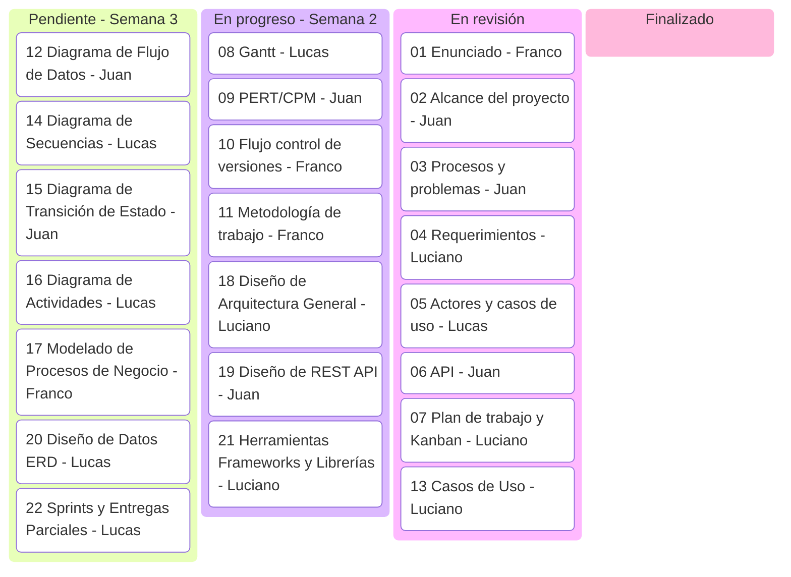

# Plan de Trabajo — Sistema de Gestión de Tickets de Soporte

## Semana 1 — Relevamiento y Documentación Inicial (Hecho)

| Archivo | Tarea | Responsable |
|---|---|---|
| `01_enunciado.md` | Enunciado | Franco |
| `02_alcance_proyecto.md` | Alcance del proyecto | Juan |
| `03_procesos_problema.md` | Procesos y problemas | Juan |
| `04_requerimientos.md` | Requerimientos | Luciano |
| `05_actores_casos_de_uso.md` | Actores y casos de uso | Lucas |
| `06_api.md` | API | Juan |

## Semana 2 — Administración de Proyectos (En progreso)

| Archivo | Tarea | Responsable |
|---|---|---|
| `07_plan_de_trabajo.md` | Plan de trabajo y Kanban | Luciano |
| `08_gannt.md` | Diagrama de Gantt | Lucas |
| `09_pert_cpm.md` | Diagrama PERT/CPM | Juan |
| `10_flujo_control_versiones.md` | Flujo de control de versiones | Franco |
| `11_metodologia_trabajo.md` | Metodología de trabajo | Franco |

## Semana 3 — Modelado de Datos y Procesos (Pendiente)

| Archivo | Tarea | Responsable |
|---|---|---|
| `12_diagrama_flujo_datos.md` | DFD | Juan |
| `13_casos_de_uso.md` | Casos de Uso | Luciano |
| `14_diagrama_secuencias.md` | Secuencia | Lucas |
| `15_diagrama_transicion_estado.md` | Transición de Estado | Juan |
| `16_diagrama_actividades.md` | Actividades | Lucas |
| `17_modelado_procesos_negocio.md` | Modelado del Proceso de Negocio | Franco |

## Semana 4 — Diseño de Interfaces, Datos y Arquitectura (En progreso)

| Archivo | Tarea | Responsable |
|---|---|---|
| `18_diseño_arquitectura_general.md` | Diseño de la arquitectura general | Luciano |
| `19_diseño_rest_api.md` | Diseño de la REST API | Juan |
| `20_diseño_de_Datos_ERD.md` | Diseño de Datos (ERD) | Lucas |
| `21_herramientas_frameworks_librerías.md` | Herramientas, frameworks y librerías | Luciano |
| `22_sprints_entregas_parciales.md` | Planificar sprints o entregas parciales | Lucas |

## Semana 5 a 13 — Resto del proyecto (Pendiente)

| Semana | Fecha | Etapa | Responsable |
|---|---|---|---|
| 4 | 14/09 | Arquitectura, API REST, ERD | A definir |
| 5 | 21/09 | Tests (TDD) | A definir |
| 6 | 28/09 | Backend: inicio de implementación | A definir |
| 7 | 05/10 | Backend: fin de desarrollo | A definir |
| 8 | 12/10 | Presentación preliminar | A definir |
| 9 | 19/10 | Frontend: diseño de UI | A definir |
| 10 | 26/10 | Frontend: inicio de implementación | A definir |
| 11 | 02/11 | Frontend: fin de desarrollo | A definir |
| 12 | 09/11 | Integración y pruebas | A definir |
| 13 | 16/11 | Entrega y presentación final | Equipo completo |

El reparto de Semana 4 en adelante se define más cerca de cada fecha.

## Kanban del proyecto

A continuación se deja el código Mermaid del estado general del trabajo. Para visualizarlo o actualizarlo a medida que avanza el proyecto, pegar el código en https://mermaid.live

**Significado de cada etapa:**

- **Pendiente**: tarea asignada a un responsable, sin avances.
- **En progreso**: el responsable se encuentra trabajando las primeras versiones.
- **En revisión**: se requiere revisión del equipo.
- **Finalizado**: la tarea pasó la revisión del equipo, quedó en su versión definitiva y está lista para la entrega al profesor.

