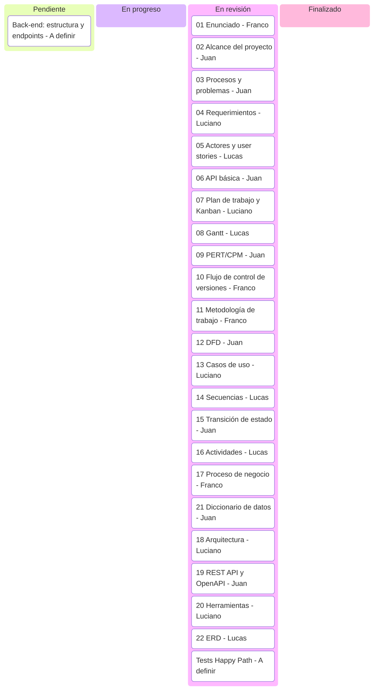

# Plan de Trabajo y Kanban — Sistema de Gestión de Tickets de Soporte

> **Actualización 30/09:** toda la documentación (01 a 22 y `documentacion/openapi/`) se reescribió con el modelo definitivo del sistema: tablas `agente` y `ticket`, asignación automática de agente, estados *Asignado → En proceso → En revisión → Cerrado* y reportes de frecuencia por categoría, tiempo promedio de resolución y top de categorías. Por eso todos los documentos vuelven a la columna **En revisión** del Kanban hasta que el equipo los apruebe.

## Semana 1 — Análisis de casos de negocio

| Archivo | Tarea | Responsable |
|---|---|---|
| `01_enunciado.md` | Enunciado | Franco |
| `02_alcance_proyecto.md` | Alcance del proyecto | Juan |
| `03_procesos_problema.md` | Procesos y problemas | Juan |
| `04_requerimientos.md` | Requerimientos funcionales y no funcionales | Luciano |
| `05_actores_casos_de_uso.md` | Actores, user stories y escenarios Gherkin | Lucas |
| `06_api.md` | API básica (endpoints previstos) | Juan |

## Semana 2 — Administración de proyectos

| Archivo | Tarea | Responsable |
|---|---|---|
| `07_plan_de_trabajo_y_Kanban.md` | Plan de trabajo y Kanban | Luciano |
| `08_gannt.md` | Diagrama de Gantt | Lucas |
| `09_pert_cpm.md` | Diagrama PERT/CPM | Juan |
| `10_flujo_control_versiones.md` | Flujo de control de versiones | Franco |
| `11_metodologia_trabajo.md` | Metodología de trabajo y entregas parciales | Franco |

## Semana 3 — Modelado de datos y procesos

| Archivo | Tarea | Responsable |
|---|---|---|
| `12_diagrama_flujo_datos.md` | DFD | Juan |
| `13_casos_de_uso.md` | Diagrama de casos de uso | Luciano |
| `14_diagrama_secuencias.md` | Diagramas de secuencia | Lucas |
| `15_diagrama_transicion_estado.md` | Diagrama de transición de estado | Juan |
| `16_diagrama_actividades.md` | Diagrama de actividades | Lucas |
| `17_modelado_procesos_negocio.md` | Modelado del proceso de negocio | Franco |
| `21_diccionario_de_datos.md` | Diccionario de datos (complemento del DFD) | Juan |

## Semana 4 — Diseño de interfaces, datos y arquitectura

| Archivo | Tarea | Responsable |
|---|---|---|
| `18_arquitectura.md` | Arquitectura general | Luciano |
| `19_rest_api.md` + `documentacion/openapi/` | Diseño de la REST API (OpenAPI) | Juan |
| `20_herramientas_frameworks_librerias.md` | Herramientas, frameworks y librerías | Luciano |
| `22_diseno_datos_erd.md` | Diseño de datos (ERD) | Lucas |
| `11_metodologia_trabajo.md` (sección entregas parciales) | Planificación de sprints / entregas parciales | Lucas |

## Semanas 5 a 13

| Semana | Fecha | Etapa | Responsable |
|---|---|---|---|
| 5 | 21/09 | Tests Happy Path (Hurl + Prism) — `gherkin/` + `hurl/`, pasan contra el mock de Prism | A definir |
| 6 | 28/09 | Back-end: estructura, endpoints básicos, base de datos | A definir |
| 7 | 05/10 | Back-end: lógica de negocio (asignación, reportes) y Docker | A definir |
| 8 | 12/10 | Presentación preliminar | Equipo completo |
| 9 | 19/10 | Front-end: wireframes y UX | A definir |
| 10 | 26/10 | Front-end: pantallas básicas | A definir |
| 11 | 02/11 | Front-end: formularios, validaciones y Docker | A definir |
| 12 | 09/11 | Integración (Docker Compose) y pruebas | A definir |
| 13 | 16/11 | Entrega y presentación final | Equipo completo |

El reparto de las semanas 5 en adelante se define al comienzo de cada semana (ver `11_metodologia_trabajo.md`).

## Kanban del proyecto

Para verlo o actualizarlo, pegar el código en <https://mermaid.live>.

| Columna | Significado |
|---|---|
| **Pendiente** | Tarea asignada a un responsable, sin avances. |
| **En progreso** | El responsable está trabajando las primeras versiones. |
| **En revisión** | Necesita revisión del equipo. |
| **Finalizado** | Pasó la revisión, está en su versión definitiva y lista para entregar al profesor. |

```mermaid
kanban
  Pendiente[Pendiente]
    s6a[Back-end: estructura y endpoints - A definir]
  En_progreso[En progreso]
  En_revision[En revisión]
    s1a[01 Enunciado - Franco]
    s1b[02 Alcance del proyecto - Juan]
    s1c[03 Procesos y problemas - Juan]
    s1d[04 Requerimientos - Luciano]
    s1e[05 Actores y user stories - Lucas]
    s1f[06 API básica - Juan]
    s2a[07 Plan de trabajo y Kanban - Luciano]
    s2b[08 Gantt - Lucas]
    s2c[09 PERT/CPM - Juan]
    s2d[10 Flujo de control de versiones - Franco]
    s2e[11 Metodología de trabajo - Franco]
    s3a[12 DFD - Juan]
    s3b[13 Casos de uso - Luciano]
    s3c[14 Secuencias - Lucas]
    s3d[15 Transición de estado - Juan]
    s3e[16 Actividades - Lucas]
    s3f[17 Proceso de negocio - Franco]
    s3g[21 Diccionario de datos - Juan]
    s4a[18 Arquitectura - Luciano]
    s4b[19 REST API y OpenAPI - Juan]
    s4c[20 Herramientas - Luciano]
    s4d[22 ERD - Lucas]
    s5a[Tests Happy Path - A definir]
  Finalizado[Finalizado]
```
