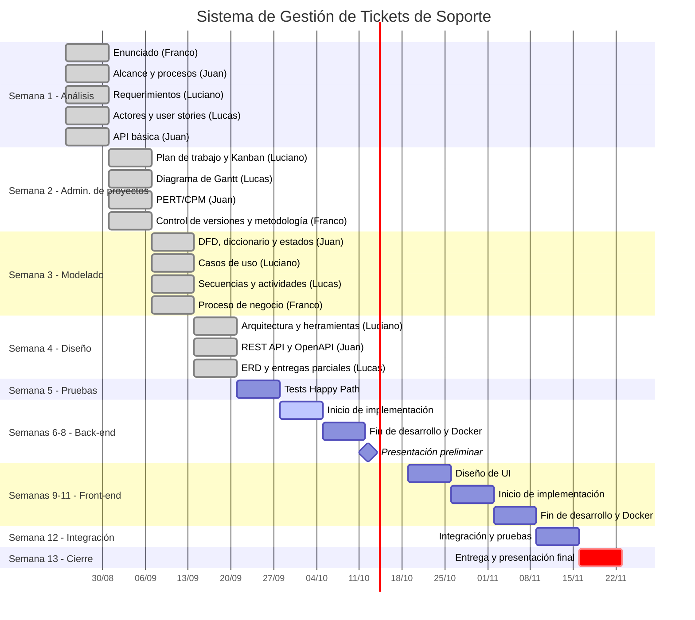

# Diagrama de Gantt

El diagrama muestra las 13 semanas del cronograma de la cátedra (`planifProfesor.md`), con una barra por tarea y su responsable. Las tareas ya entregadas figuran como completadas (`done`), la semana en curso como activa (`active`) y la entrega final como crítica (`crit`).

