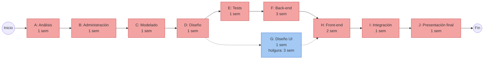

# Diagrama PERT / CPM

Responsable: Juan

El PERT muestra las actividades del proyecto, sus dependencias y su duración en semanas. El **camino crítico** (CPM) es la secuencia de actividades sin holgura: si cualquiera de ellas se atrasa, se atrasa la entrega final.

## Actividades

| Id | Actividad | Duración | Depende de | Semanas del cronograma |
|---|---|---|---|---|
| A | Análisis de casos de negocio | 1 sem | — | 1 |
| B | Administración del proyecto | 1 sem | A | 2 |
| C | Modelado de datos y procesos | 1 sem | B | 3 |
| D | Diseño de arquitectura, API y datos | 1 sem | C | 4 |
| E | Tests Happy Path | 1 sem | D | 5 |
| F | Back-end (implementación + presentación preliminar) | 3 sem | E | 6 a 8 |
| G | Diseño de interfaces de usuario | 1 sem | D | 9 |
| H | Front-end (implementación) | 2 sem | F, G | 10 y 11 |
| I | Integración y pruebas | 1 sem | H | 12 |
| J | Presentación final | 1 sem | I | 13 |

## Diagrama

En rojo, el camino crítico; en azul, la actividad con holgura.

## Camino crítico

**A → B → C → D → E → F → H → I → J** = 1 + 1 + 1 + 1 + 1 + 3 + 2 + 1 + 1 = **12 semanas** de trabajo.

- **G (Diseño UI)** solo necesita el diseño de la API (D), así que podría hacerse en cualquier momento entre la semana 5 y la 8 sin atrasar el proyecto: tiene **3 semanas de holgura**. El cronograma de la cátedra la ubica en la semana 9, lo que la deja pegada al front-end.
- La semana restante del cronograma (13 en total) funciona como margen para la presentación preliminar y los ajustes pedidos por el docente.
