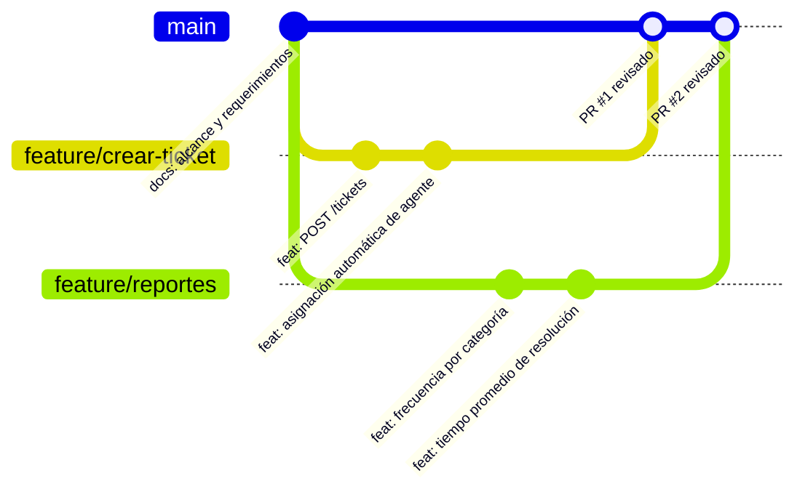

# Flujo de Control de Versiones

Responsable: Franco

El equipo usa **Git** con un flujo de ramas por tarea (*feature branch workflow*):

- **`main` protegida:** solo entra código o documentación revisada por otra persona.
- **Una rama por tarea:** `feature/<nombre-de-la-tarea>` para código y `docs/<nombre>` para documentación.
- **Commits con prefijo** según el tipo de cambio: `feat:`, `fix:`, `docs:`, `test:`, `refactor:`.
- **Pull Request obligatorio** para mergear a `main`, con revisión de al menos otro integrante.
- Antes de abrir el PR, se actualiza la rama con lo último de `main` para resolver conflictos localmente.

## Ejemplo de flujo

## Ramas previstas para el back-end

| Rama | Contenido |
|---|---|
| `feature/estructura-proyecto` | Estructura base, conexión a la base de datos, carga de agentes |
| `feature/crear-ticket` | `POST /tickets` con asignación automática |
| `feature/consultas-dni` | `GET /clientes/{dni}/tickets`, `GET /agentes/{dni}/tickets`, `GET /tickets/{id}` |
| `feature/estado-ticket` | `PATCH /tickets/{id}/estado` y registro de fecha de finalización |
| `feature/reportes` | Los tres endpoints de `/reportes` |
| `feature/docker` | Dockerfile y Docker Compose |
