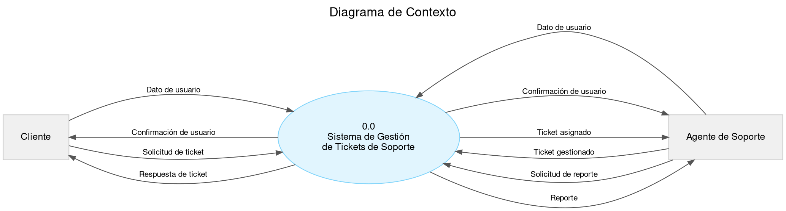
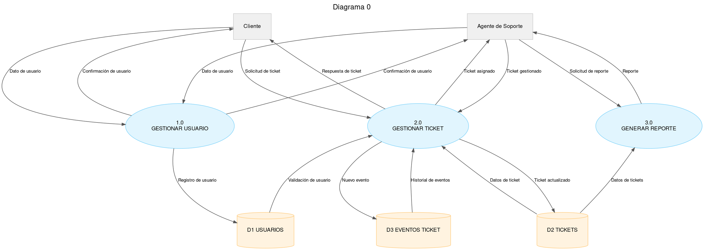

# Sistema de Gestión de Tickets de Soporte — Diagramas de Flujo de Datos

Ver Diagrama de Contexto en GraphvizOnline: https://dreampuf.github.io/GraphvizOnline

## Diagrama de Contexto

## Diagrama 0

