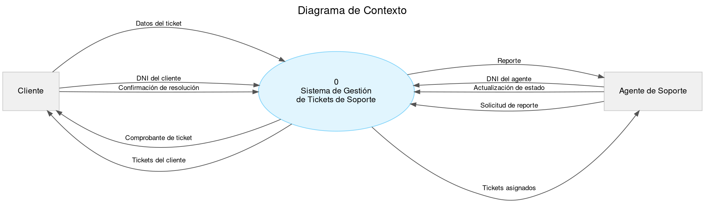
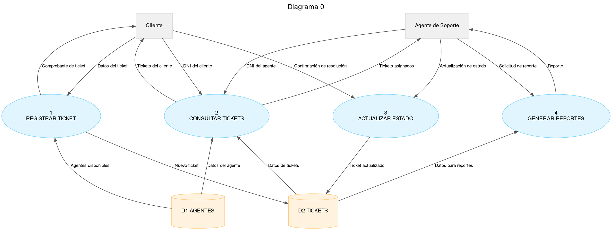

# Diagramas de Flujo de Datos (DFD)

Responsable: Juan

Herramienta: **Graphviz**. Para visualizarlos, pegar cada bloque `dot` en <https://dreampuf.github.io/GraphvizOnline>.

El detalle de cada entidad, proceso, almacenamiento y flujo está en `21_diccionario_de_datos.md`.

## Notación

| Forma | Elemento |
|---|---|
| Rectángulo gris | Entidad externa |
| Elipse celeste | Proceso |
| Cilindro naranja | Almacenamiento de datos |
| Flecha | Flujo de datos |

## 1. Diagrama de contexto (nivel 0)

Muestra el sistema como un único proceso y su intercambio de datos con las dos entidades externas: el **Cliente** y el **Agente de soporte**.

```dot
digraph DiagramaContexto {
    rankdir=LR;
    splines=true;
    nodesep=0.8;
    ranksep=2.4;
    fontname="Helvetica,Arial,sans-serif";
    labelloc="t";
    label="Diagrama de Contexto";
    fontsize=16;

    node [fontname="Helvetica,Arial,sans-serif", fontsize=12, margin=0.3];
    edge [fontname="Helvetica,Arial,sans-serif", fontsize=10, color="#555555", arrowsize=0.8];

    // Entidades externas
    node [shape=box, style=filled, fillcolor="#f0f0f0", color="#cccccc"];
    C [label="Cliente"];
    A [label="Agente de Soporte"];

    // Proceso central
    node [shape=ellipse, style=filled, fillcolor="#e1f5fe", color="#81d4fa"];
    P0 [label="0\nSistema de Gestión\nde Tickets de Soporte"];

    // Cliente
    C -> P0 [label="Datos del ticket"];
    P0 -> C [label="Comprobante de ticket"];
    C -> P0 [label="DNI del cliente"];
    P0 -> C [label="Tickets del cliente"];
    C -> P0 [label="Confirmación de resolución"];

    // Agente
    P0 -> A [label="Tickets asignados"];
    A -> P0 [label="DNI del agente"];
    A -> P0 [label="Actualización de estado"];
    A -> P0 [label="Solicitud de reporte"];
    P0 -> A [label="Reporte"];
}
```

## 2. Diagrama 0 (nivel 1)

Descompone el sistema en cuatro procesos y dos almacenamientos.

| Proceso | Qué hace |
|---|---|
| **1 Registrar ticket** | Recibe los datos del cliente, elige un agente al azar y guarda el ticket en estado *Asignado* con su fecha de inicio. |
| **2 Consultar tickets** | Devuelve los tickets de un cliente o los asignados a un agente, según el DNI ingresado. |
| **3 Actualizar estado** | Guarda el nuevo estado que informa el agente o el cliente; si es *Cerrado*, registra la fecha de finalización. |
| **4 Generar reportes** | Calcula la frecuencia por categoría, el tiempo promedio de resolución y el top de categorías. |

| Almacenamiento | Contenido |
|---|---|
| **D1 Agentes** | DNI y nombre de los agentes (precargados). |
| **D2 Tickets** | Todos los tickets con su agente, estado y fechas. |

```dot
digraph Diagrama0 {
    rankdir=TB;
    splines=true;
    nodesep=1.0;
    ranksep=1.6;
    fontname="Helvetica,Arial,sans-serif";
    labelloc="t";
    label="Diagrama 0";
    fontsize=16;

    node [fontname="Helvetica,Arial,sans-serif", fontsize=12, margin=0.3];
    edge [fontname="Helvetica,Arial,sans-serif", fontsize=10, color="#555555", arrowsize=0.8];

    // Entidades externas
    {
        rank=same;
        node [shape=box, style=filled, fillcolor="#f0f0f0", color="#cccccc"];
        C [label="Cliente"];
        A [label="Agente de Soporte"];
        C -> A [style=invis];
    }

    // Procesos
    {
        rank=same;
        node [shape=ellipse, style=filled, fillcolor="#e1f5fe", color="#81d4fa"];
        P1 [label="1\nREGISTRAR TICKET"];
        P2 [label="2\nCONSULTAR TICKETS"];
        P3 [label="3\nACTUALIZAR ESTADO"];
        P4 [label="4\nGENERAR REPORTES"];
        P1 -> P2 -> P3 -> P4 [style=invis];
    }

    // Almacenamientos
    {
        rank=same;
        node [shape=cylinder, style=filled, fillcolor="#fff3e0", color="#ffcc80"];
        D1 [label="D1 AGENTES"];
        D2 [label="D2 TICKETS"];
        D1 -> D2 [style=invis];
    }

    // 1 Registrar ticket
    C  -> P1 [label="Datos del ticket"];
    P1 -> C  [label="Comprobante de ticket"];
    D1 -> P1 [label="Agentes disponibles"];
    P1 -> D2 [label="Nuevo ticket"];

    // 2 Consultar tickets
    C  -> P2 [label="DNI del cliente"];
    P2 -> C  [label="Tickets del cliente"];
    A  -> P2 [label="DNI del agente"];
    P2 -> A  [label="Tickets asignados"];
    D1 -> P2 [label="Datos del agente"];
    D2 -> P2 [label="Datos de tickets"];

    // 3 Actualizar estado
    A  -> P3 [label="Actualización de estado"];
    C  -> P3 [label="Confirmación de resolución"];
    P3 -> D2 [label="Ticket actualizado"];

    // 4 Generar reportes
    A  -> P4 [label="Solicitud de reporte"];
    P4 -> A  [label="Reporte"];
    D2 -> P4 [label="Datos para reportes"];
}
```
