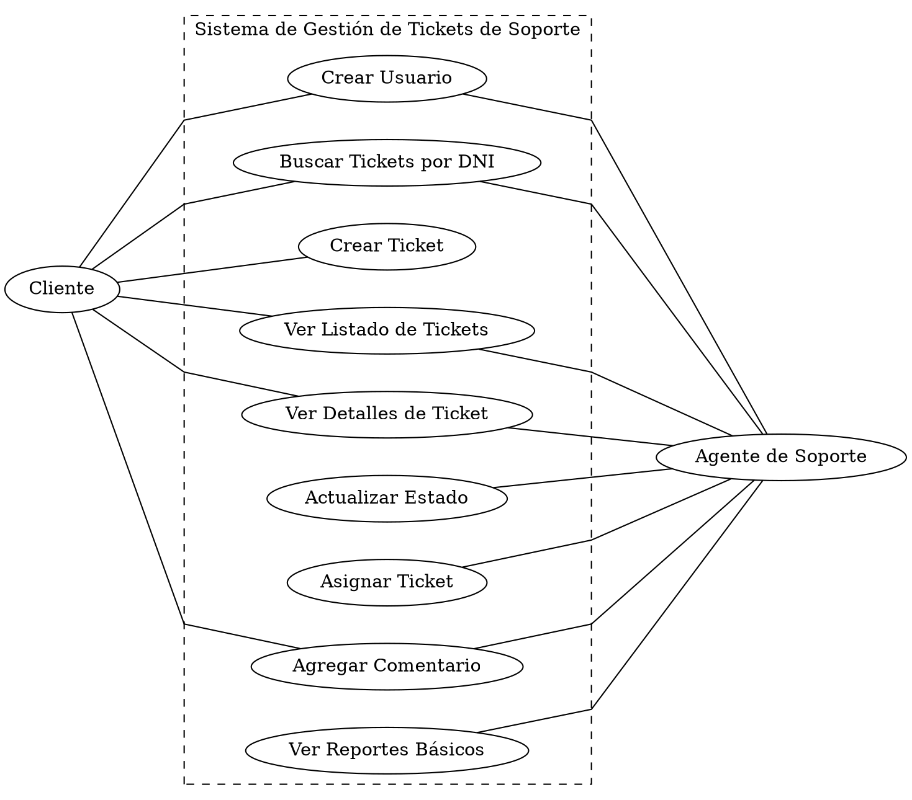

# Casos de Uso

El siguiente diagrama muestra las asociaciones entre los dos actores del sistema (Cliente y Agente de Soporte) y las 9 funcionalidades identificadas. A continuación, cada una se detalla en su propia plantilla de caso de uso, con su flujo principal y los flujos alternativos que cubren los casos de error o excepción.

## Diagrama de Casos de Uso

Código Graphviz (visualizar en https://dreampuf.github.io/GraphvizOnline/):

## CU-01: Crear Usuario

* ID: CU-01
* Nombre: Crear Usuario
* Actores: Cliente, Agente de Soporte
* Descripción: Registra a una persona en el sistema mediante su DNI, de modo que pueda operar posteriormente sin necesidad de contraseña.
* Precondiciones: El usuario debe encontrarse en la interfaz principal del sistema.
* Disparador: El usuario hace clic en el botón "Crear Usuario".
* Flujo Principal:
   1. El sistema despliega el formulario de registro, solicitando nombre completo, DNI, correo electrónico y rol (Cliente o Agente).
   2. El usuario completa los datos y confirma mediante el botón "Crear Usuario".
   3. El sistema verifica que todos los campos obligatorios estén completos.
   4. El sistema verifica que el DNI ingresado no se encuentre ya registrado.
   5. El sistema registra al nuevo usuario con los datos provistos.
   6. El sistema confirma que el registro se realizó correctamente.
* Flujos Alternativos:
   * 3a. Campos incompletos: si falta algún dato obligatorio, el sistema informa "Complete todos los campos" y la operación no se concreta.
   * 4a. DNI existente: si el DNI ya pertenece a otro usuario, el sistema informa "DNI ya registrado" y cancela el alta.
* Postcondiciones: El usuario queda registrado en el sistema y disponible para ser consultado por DNI.

## CU-02: Buscar Tickets por DNI

* ID: CU-02
* Nombre: Buscar Tickets por DNI
* Actores: Cliente, Agente de Soporte
* Descripción: Permite a un usuario consultar los tickets que le corresponden según su rol, ingresando su DNI en el buscador principal.
* Precondiciones: El DNI debe estar previamente registrado en el sistema.
* Disparador: El usuario ingresa su DNI en la pantalla principal y hace clic en "Buscar".
* Flujo Principal:
   1. El sistema recibe el DNI ingresado.
   2. El sistema busca el DNI en el registro de usuarios y determina su rol:
      * Si corresponde a un Cliente, recupera los tickets creados por ese DNI.
      * Si corresponde a un Agente, recupera los tickets asignados a ese DNI.
   3. El sistema muestra la tabla con los tickets correspondientes.
* Flujos Alternativos:
   * 1a. Campo vacío: si no se ingresó ningún valor, el sistema informa "Ingresa tu DNI".
   * 2a. DNI no registrado: si el DNI no existe en el sistema, informa "DNI no encontrado".
   * 2b. Usuario sin tickets: si el DNI existe pero no tiene tickets asociados, informa "No tienes tickets aún".
* Postcondiciones: Queda visible la bandeja de tickets correspondiente al rol del usuario consultado.

## CU-03: Crear Ticket

* ID: CU-03
* Nombre: Crear Ticket
* Actores: Cliente
* Descripción: Permite al cliente reportar una consulta, problema o incidente mediante un flujo de tres pasos.
* Precondiciones: El cliente debe estar registrado con su DNI en el sistema.
* Disparador: El cliente hace clic en el botón o enlace "Crear Ticket".
* Flujo Principal:
   1. El sistema despliega el formulario de alta.
   2. El cliente completa el Asunto y la Descripción.
   3. El cliente selecciona una Categoría del listado desplegable y, opcionalmente, adjunta archivos.
   4. El cliente confirma los datos mediante el botón "Crear Ticket".
   5. El sistema verifica que se hayan completado los campos obligatorios.
   6. El sistema genera un identificador único, asigna la fecha y hora actuales, fija el estado en "Abierto" y vincula el ticket al DNI del cliente.
   7. El sistema confirma la creación e indica el número de ticket asignado.
* Flujos Alternativos:
   * 5a. Asunto omitido: el sistema informa "Asunto obligatorio".
   * 5b. Descripción omitida: el sistema informa "Descripción obligatoria".
   * 5c. Categoría sin seleccionar: el sistema informa "Selecciona una categoría".
* Postcondiciones: El ticket queda registrado en el sistema con estado "Abierto".

## CU-04: Ver Listado de Tickets

* ID: CU-04
* Nombre: Ver Listado de Tickets
* Actores: Cliente, Agente de Soporte
* Descripción: Presenta en formato de tabla, con opción de filtrado, el estado general de los tickets asociados al usuario.
* Precondiciones: El usuario debe haber ingresado su DNI correctamente en la búsqueda.
* Disparador: Se cargan los resultados de la búsqueda, o el usuario regresa a la bandeja de trabajo.
* Flujo Principal:
   1. El sistema muestra la tabla con las columnas ID, Asunto, Categoría, Estado, Fecha de creación y Última actualización.
   2. Los registros se ordenan de forma descendente por fecha, mostrando primero los más recientes.
* Flujos Alternativos:
   * 1a. Aplicación de filtro: si el usuario selecciona un estado específico (por ejemplo, "En Progreso"), el sistema actualiza la tabla mostrando únicamente los tickets que cumplen ese criterio.
* Postcondiciones: La lista de tickets queda disponible para que el usuario seleccione un registro.

## CU-05: Ver Detalles de Ticket

* ID: CU-05
* Nombre: Ver Detalles de Ticket
* Actores: Cliente, Agente de Soporte
* Descripción: Presenta la información completa y el historial de un ticket puntual.
* Precondiciones: El ticket consultado debe existir en el sistema.
* Disparador: El usuario hace clic sobre una fila del listado.
* Flujo Principal:
   1. El sistema muestra ID, asunto, descripción, categoría, estado actual, fecha de creación y agente asignado.
   2. El sistema muestra el historial de comentarios en orden cronológico, indicando autor, fecha y hora, y contenido de cada mensaje.
   3. El sistema habilita el campo para redactar un nuevo comentario.
* Postcondiciones: Quedan visibles tanto los datos del ticket como su historial de seguimiento completo.

## CU-06: Actualizar Estado

* ID: CU-06
* Nombre: Actualizar Estado
* Actores: Agente de Soporte
* Descripción: Permite al agente modificar la etapa del ciclo de vida en la que se encuentra el ticket.
* Precondiciones: El agente debe encontrarse en la vista de detalle de un ticket existente.
* Disparador: El agente selecciona una opción distinta en el desplegable de estados.
* Flujo Principal:
   1. El agente elige uno de los estados disponibles: Abierto, En Progreso, Esperando al Cliente, Resuelto o Cerrado.
   2. El sistema actualiza el registro, guardando el nuevo estado, el DNI del agente responsable y la fecha y hora del cambio.
   3. El sistema refleja el nuevo estado en la interfaz en un plazo menor a 2 segundos.
* Postcondiciones: El ticket queda con el nuevo estado, y el cambio se registra en su historial.

## CU-07: Asignar Ticket

* ID: CU-07
* Nombre: Asignar Ticket
* Actores: Agente de Soporte
* Descripción: Permite transferir la responsabilidad de resolución de un ticket a otro agente.
* Precondiciones: El ticket debe existir y el agente debe encontrarse en su pantalla de detalle.
* Disparador: El agente hace clic en la opción "Asignar a Agente".
* Flujo Principal:
   1. El sistema despliega el listado de agentes disponibles.
   2. El agente selecciona al responsable de destino y confirma la asignación.
   3. El sistema registra quién realizó la asignación, a quién fue asignado el ticket y la fecha y hora exactas.
   4. El sistema actualiza el campo de agente asignado en la vista.
* Postcondiciones: El ticket queda asociado al nuevo agente y aparecerá en su listado al buscar por su DNI.

## CU-08: Agregar Comentario

* ID: CU-08
* Nombre: Agregar Comentario
* Actores: Cliente, Agente de Soporte
* Descripción: Habilita la comunicación entre el cliente y el agente dentro del mismo hilo del ticket.
* Precondiciones: El usuario debe tener abierto el detalle del ticket.
* Disparador: El usuario redacta un mensaje en el campo "Agregar comentario" y hace clic en "Enviar".
* Flujo Principal:
   1. El sistema verifica que el campo de texto no esté vacío.
   2. El sistema asocia el comentario al DNI del autor, la fecha y hora actuales y el ticket correspondiente.
   3. El sistema registra el comentario.
   4. El sistema actualiza el historial en pantalla, incorporando el comentario de inmediato.
* Flujos Alternativos:
   * 1a. Comentario vacío: si se presiona "Enviar" sin haber escrito texto, el sistema informa "El comentario no puede estar vacío" y no efectúa el registro.
* Postcondiciones: El comentario pasa a formar parte del historial visible del ticket.

## CU-09: Ver Reportes Básicos

* ID: CU-09
* Nombre: Ver Reportes Básicos
* Actores: Agente de Soporte
* Descripción: Presenta un panel con métricas sobre el volumen y el estado general de las solicitudes.
* Precondiciones: Deben existir tickets registrados en el sistema.
* Disparador: El agente ingresa al módulo de reportes desde la barra de navegación.
* Flujo Principal:
   1. El sistema calcula, a partir de la base de datos:
      * El total acumulado de tickets registrados.
      * La cantidad de tickets agrupados por estado (Abierto, En Progreso, Esperando, Resuelto, Cerrado).
      * Las categorías más frecuentes.
   2. El sistema presenta los resultados distribuidos en tres secciones de la pantalla.
* Postcondiciones: La información estadística queda disponible en modo consulta.
