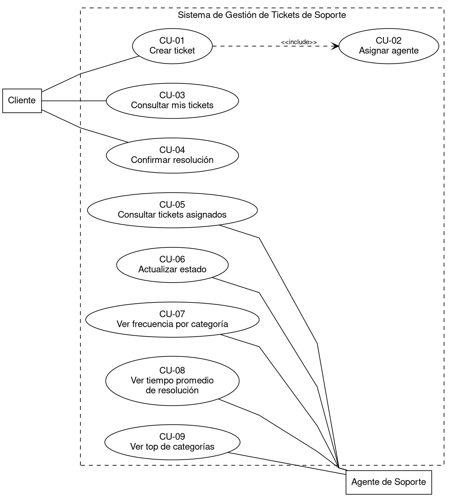

# Casos de Uso

Responsable: Luciano

El diagrama muestra las asociaciones entre los actores (Cliente y Agente de soporte) y los 9 casos de uso del sistema. *Asignar agente* no lo dispara una persona: el sistema lo ejecuta siempre dentro de *Crear ticket* (relación `<<include>>`). Cada caso de uso corresponde a la user story del mismo número en `05_actores_casos_de_uso.md`.

## Diagrama de casos de uso

Herramienta: **Graphviz** (visualizar en <https://dreampuf.github.io/GraphvizOnline>).

```dot
digraph CasosDeUso {
    rankdir=LR;
    splines=polyline;
    nodesep=0.4;
    ranksep=0.9;
    fontname="Helvetica,Arial,sans-serif";
    node [fontname="Helvetica,Arial,sans-serif", shape=ellipse];
    edge [fontname="Helvetica,Arial,sans-serif", fontsize=10, dir=none];

    Cliente [label="Cliente", shape=box];
    Agente  [label="Agente de Soporte", shape=box];

    subgraph cluster_sistema {
        label="Sistema de Gestión de Tickets de Soporte";
        style=dashed;

        UC1 [label="CU-01\nCrear ticket"];
        UC2 [label="CU-02\nAsignar agente"];
        UC3 [label="CU-03\nConsultar mis tickets"];
        UC4 [label="CU-04\nConfirmar resolución"];
        UC5 [label="CU-05\nConsultar tickets asignados"];
        UC6 [label="CU-06\nActualizar estado"];
        UC7 [label="CU-07\nVer frecuencia por categoría"];
        UC8 [label="CU-08\nVer tiempo promedio\nde resolución"];
        UC9 [label="CU-09\nVer top de categorías"];
    }

    Cliente -> UC1;
    Cliente -> UC3;
    Cliente -> UC4;

    UC5 -> Agente;
    UC6 -> Agente;
    UC7 -> Agente;
    UC8 -> Agente;
    UC9 -> Agente;

    UC1 -> UC2 [label="<<include>>", style=dashed, dir=forward, arrowhead=open];
}
```

## CU-01: Crear ticket

* **Actor:** Cliente
* **Descripción:** El cliente reporta un problema, consulta o reclamo.
* **Precondiciones:** Hay al menos un agente cargado en el sistema.
* **Disparador:** El cliente hace clic en "Crear ticket" en la interfaz principal.
* **Flujo principal:**
   1. El sistema muestra el formulario con DNI, categoría (lista desplegable) y descripción.
   2. El cliente completa los datos y confirma.
   3. El sistema verifica que los tres campos estén completos y que la categoría sea válida.
   4. El sistema genera el número de ticket y registra la fecha de inicio.
   5. El sistema ejecuta **CU-02 Asignar agente**.
   6. El sistema guarda el ticket en estado **Asignado**.
   7. El sistema muestra el número de ticket y el nombre del agente asignado.
* **Flujos alternativos:**
   * 3a. Falta un campo: el sistema informa "Complete todos los campos" y no guarda nada.
   * 3b. Categoría inválida: el sistema informa "Categoría inválida".
   * 5a. No hay agentes: el sistema informa "No hay agentes disponibles" y no guarda el ticket.
* **Postcondiciones:** El ticket queda registrado, con agente y en estado Asignado.

## CU-02: Asignar agente

* **Actor:** Cliente (caso incluido en CU-01; lo ejecuta el sistema automáticamente)
* **Descripción:** Asigna automáticamente un responsable a cada ticket nuevo.
* **Precondiciones:** Se está creando un ticket.
* **Disparador:** Paso 5 de CU-01.
* **Flujo principal:**
   1. El sistema obtiene la lista de agentes cargados.
   2. El sistema elige uno al azar.
   3. El sistema guarda el DNI del agente en el ticket.
* **Flujos alternativos:**
   * 1a. La lista está vacía: se cancela la creación del ticket (CU-01, 5a).
* **Postcondiciones:** El ticket tiene exactamente un agente. No se reasigna.

## CU-03: Consultar mis tickets

* **Actor:** Cliente
* **Descripción:** El cliente ve todos sus tickets y el estado de cada uno.
* **Precondiciones:** Ninguna.
* **Disparador:** El cliente ingresa su DNI en "Mis tickets" y hace clic en "Buscar".
* **Flujo principal:**
   1. El sistema busca los tickets cuyo DNI de cliente coincide.
   2. El sistema los muestra del más reciente al más antiguo, con número, categoría, descripción, estado, agente, fecha de inicio y fecha de finalización.
* **Flujos alternativos:**
   * 1a. DNI vacío: el sistema informa "Ingrese su DNI".
   * 1b. Sin resultados: el sistema informa "No hay tickets para este DNI".
* **Postcondiciones:** El cliente conoce el estado actual de sus tickets.

## CU-04: Confirmar resolución

* **Actor:** Cliente
* **Descripción:** El cliente confirma si su problema quedó resuelto.
* **Precondiciones:** El ticket está en estado **En revisión**.
* **Disparador:** En la lista de sus tickets, el cliente hace clic en "Confirmar resolución" o en "El problema sigue".
* **Flujo principal:**
   1. El cliente elige "Confirmar resolución".
   2. El sistema cambia el estado a **Cerrado** y registra la fecha de finalización.
   3. El sistema muestra el ticket actualizado.
* **Flujos alternativos:**
   * 1a. El cliente elige "El problema sigue": el sistema cambia el estado a **En proceso** y el agente lo vuelve a ver como pendiente.
* **Postcondiciones:** El ticket queda cerrado con fecha de finalización, o vuelve a En proceso.

## CU-05: Consultar tickets asignados

* **Actor:** Agente de soporte
* **Descripción:** El agente ve su bandeja de trabajo.
* **Precondiciones:** El agente está cargado en el sistema.
* **Disparador:** El agente ingresa su DNI en "Tickets asignados" y hace clic en "Buscar".
* **Flujo principal:**
   1. El sistema verifica que el DNI corresponda a un agente.
   2. El sistema muestra los tickets asignados a ese agente, del más antiguo al más reciente.
* **Flujos alternativos:**
   * 1a. El DNI no es de un agente: el sistema informa "Agente no encontrado".
   * 2a. El agente filtra por estado: el sistema muestra solo los tickets en ese estado.
* **Postcondiciones:** El agente conoce sus tickets pendientes.

## CU-06: Actualizar estado

* **Actor:** Agente de soporte
* **Descripción:** El agente informa el avance de un ticket.
* **Precondiciones:** El agente tiene a la vista uno de sus tickets.
* **Disparador:** El agente elige un nuevo estado en la lista desplegable del ticket.
* **Flujo principal:**
   1. El agente elige **En proceso** cuando empieza a trabajar el ticket.
   2. El sistema guarda el nuevo estado.
   3. Cuando termina su trabajo, el agente elige **En revisión**.
   4. El sistema guarda el estado; el ticket queda pendiente de confirmación del cliente (CU-04).
* **Flujos alternativos:**
   * 2a. Estado inválido: el sistema informa "Estado inválido".
* **Postcondiciones:** El ticket refleja el avance; cliente y agente ven el mismo estado.

## CU-07: Ver frecuencia por categoría

* **Actor:** Agente de soporte
* **Descripción:** Muestra cuántos tickets hay de cada categoría.
* **Disparador:** El agente entra a "Reportes" → "Frecuencia por categoría".
* **Flujo principal:**
   1. El sistema cuenta los tickets agrupados por categoría.
   2. El sistema muestra todas las categorías con su cantidad (incluidas las que tienen 0).
* **Postcondiciones:** Ninguna (solo consulta).

## CU-08: Ver tiempo promedio de resolución

* **Actor:** Agente de soporte
* **Descripción:** Muestra cuánto se tarda en promedio en cerrar un ticket.
* **Disparador:** El agente entra a "Reportes" → "Tiempo promedio de resolución".
* **Flujo principal:**
   1. El sistema toma los tickets en estado Cerrado.
   2. Calcula, para cada uno, la diferencia entre fecha de finalización y fecha de inicio.
   3. Muestra el promedio en horas y la cantidad de tickets considerados.
* **Flujos alternativos:**
   * 1a. El agente elige una categoría: el cálculo se hace solo con los tickets de esa categoría.
   * 1b. No hay tickets cerrados: el sistema informa "Todavía no hay tickets cerrados".
* **Postcondiciones:** Ninguna (solo consulta).

## CU-09: Ver top de categorías

* **Actor:** Agente de soporte
* **Descripción:** Muestra las categorías con más tickets.
* **Disparador:** El agente entra a "Reportes" → "Top de categorías".
* **Flujo principal:**
   1. El sistema cuenta los tickets por categoría.
   2. Ordena de mayor a menor y muestra las 3 primeras.
* **Flujos alternativos:**
   * 2a. El agente indica otra cantidad N: el sistema muestra las N primeras.
* **Postcondiciones:** Ninguna (solo consulta).
