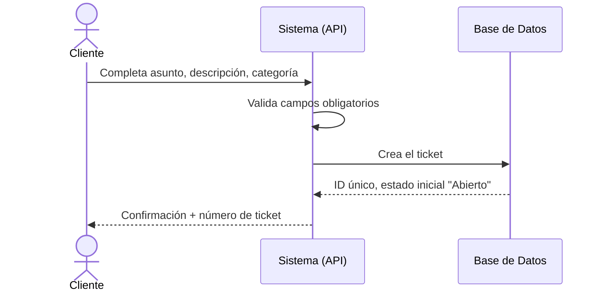
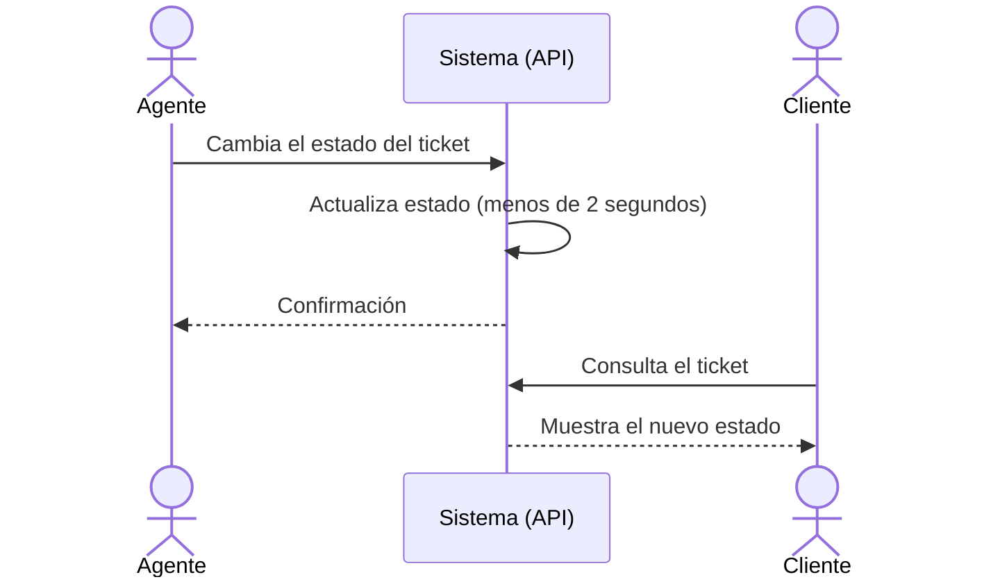

### 2. Crear Ticket (Duplicado provisto)



---

### 3. Actualizar Estado



---

### 4. Agregar Comentario

```mermaid
sequenceDiagram
actor Usuario as Cliente / Agente
participant Sistema as Sistema (API)
participant BD as Base de Datos
Usuario->>Sistema: Escribe comentario y confirma
Sistema->>BD: Guarda comentario con autor y fecha
BD-->>Sistema: Confirmación
Sistema-->>Usuario: Comentario visible en el historial

