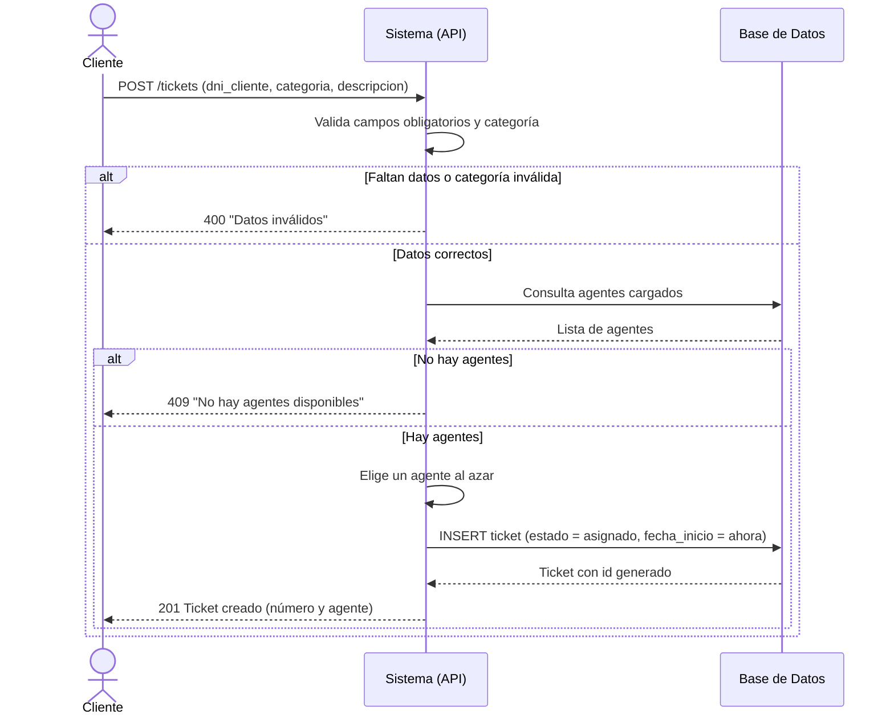
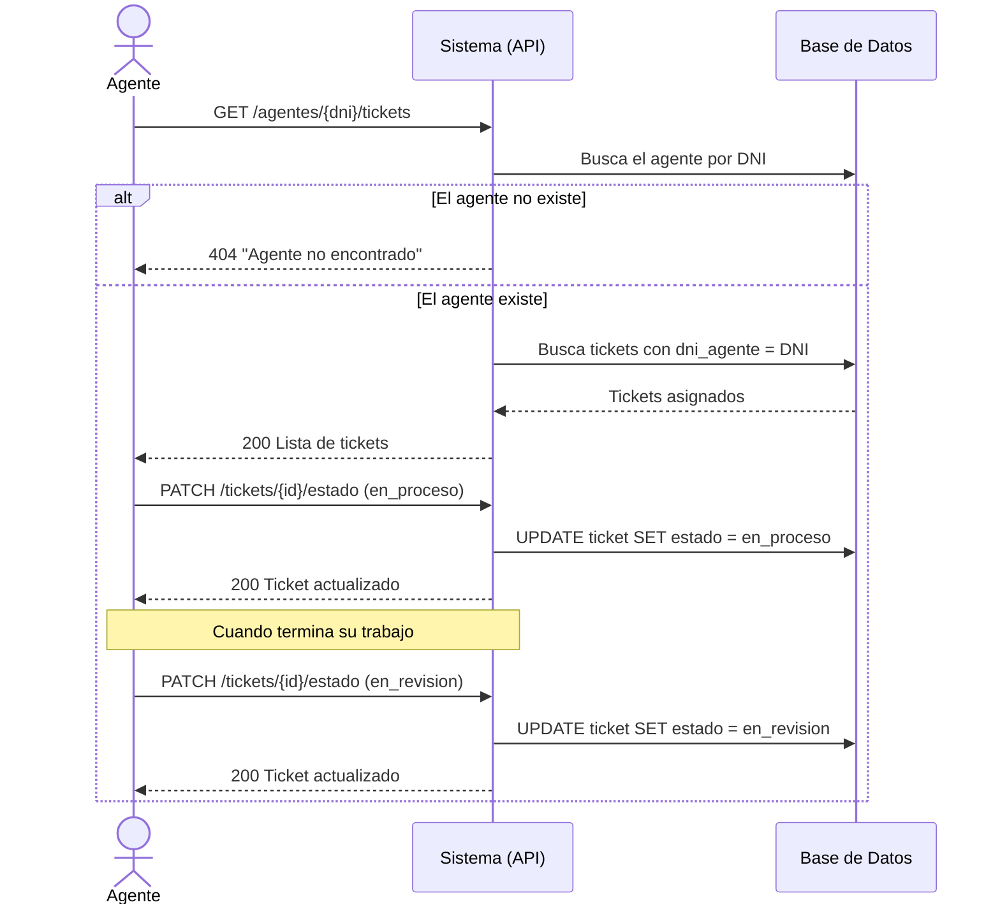
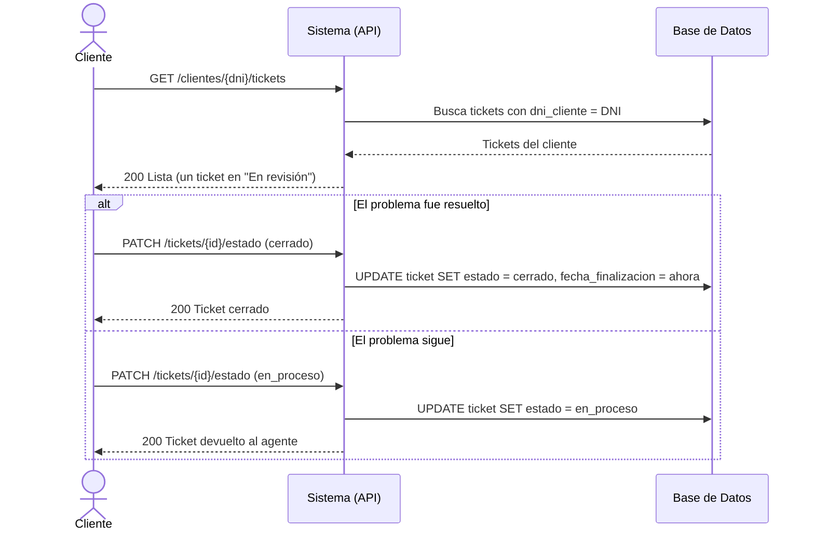
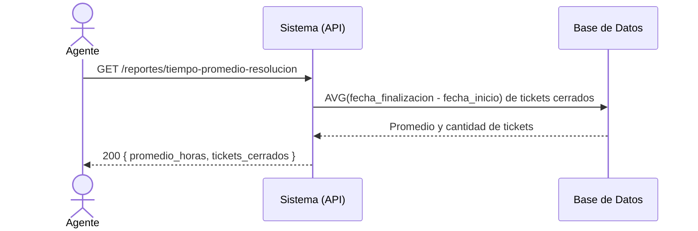

# Diagramas de Secuencia

Responsable: Lucas

Herramienta: **Mermaid** (`sequenceDiagram`). Muestran, en orden temporal, los mensajes que intercambian los actores, la API y la base de datos en los cuatro flujos principales del sistema. Los endpoints corresponden a `19_rest_api.md`.

## 1. Crear ticket (con asignación automática)

```mermaid
sequenceDiagram
    actor Cliente
    participant API as Sistema (API)
    participant BD as Base de Datos

    Cliente->>API: POST /tickets (dni_cliente, categoria, descripcion)
    API->>API: Valida campos obligatorios y categoría
    alt Faltan datos o categoría inválida
        API-->>Cliente: 400 "Datos inválidos"
    else Datos correctos
        API->>BD: Consulta agentes cargados
        BD-->>API: Lista de agentes
        alt No hay agentes
            API-->>Cliente: 409 "No hay agentes disponibles"
        else Hay agentes
            API->>API: Elige un agente al azar
            API->>BD: INSERT ticket (estado = asignado, fecha_inicio = ahora)
            BD-->>API: Ticket con id generado
            API-->>Cliente: 201 Ticket creado (número y agente)
        end
    end
```

## 2. Agente consulta sus tickets y actualiza el estado

```mermaid
sequenceDiagram
    actor Agente
    participant API as Sistema (API)
    participant BD as Base de Datos

    Agente->>API: GET /agentes/{dni}/tickets
    API->>BD: Busca el agente por DNI
    alt El agente no existe
        API-->>Agente: 404 "Agente no encontrado"
    else El agente existe
        API->>BD: Busca tickets con dni_agente = DNI
        BD-->>API: Tickets asignados
        API-->>Agente: 200 Lista de tickets
        Agente->>API: PATCH /tickets/{id}/estado (en_proceso)
        API->>BD: UPDATE ticket SET estado = en_proceso
        API-->>Agente: 200 Ticket actualizado
        Note over Agente,API: Cuando termina su trabajo
        Agente->>API: PATCH /tickets/{id}/estado (en_revision)
        API->>BD: UPDATE ticket SET estado = en_revision
        API-->>Agente: 200 Ticket actualizado
    end
```

## 3. Cliente confirma la resolución

```mermaid
sequenceDiagram
    actor Cliente
    participant API as Sistema (API)
    participant BD as Base de Datos

    Cliente->>API: GET /clientes/{dni}/tickets
    API->>BD: Busca tickets con dni_cliente = DNI
    BD-->>API: Tickets del cliente
    API-->>Cliente: 200 Lista (un ticket en "En revisión")
    alt El problema fue resuelto
        Cliente->>API: PATCH /tickets/{id}/estado (cerrado)
        API->>BD: UPDATE ticket SET estado = cerrado, fecha_finalizacion = ahora
        API-->>Cliente: 200 Ticket cerrado
    else El problema sigue
        Cliente->>API: PATCH /tickets/{id}/estado (en_proceso)
        API->>BD: UPDATE ticket SET estado = en_proceso
        API-->>Cliente: 200 Ticket devuelto al agente
    end
```

## 4. Consultar tiempo promedio de resolución

```mermaid
sequenceDiagram
    actor Agente
    participant API as Sistema (API)
    participant BD as Base de Datos

    Agente->>API: GET /reportes/tiempo-promedio-resolucion
    API->>BD: AVG(fecha_finalizacion - fecha_inicio) de tickets cerrados
    BD-->>API: Promedio y cantidad de tickets
    API-->>Agente: 200 { promedio_horas, tickets_cerrados }
```
