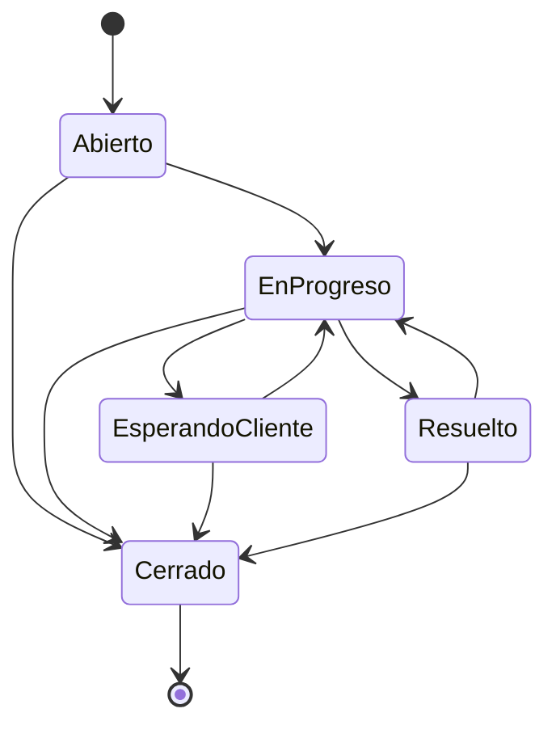

# Diagrama de Transición de Estado

## Descripción de Estados

| Estado | Significa |
|---|---|
| Abierto | El ticket fue creado (RF-003) y todavía no fue tomado por un agente. |
| En Progreso | Un agente está trabajando activamente en la resolución. |
| Esperando al Cliente | El agente necesita información adicional del cliente para continuar. |
| Resuelto | El agente considera solucionado el problema. |
| Cerrado | Estado final. El caso queda cerrado, sin más transiciones posibles. |

## Transiciones válidas

| Desde | Puede pasar a |
|---|---|
| Abierto | En Progreso, Cerrado |
| En Progreso | Esperando al Cliente, Resuelto, Cerrado |
| Esperando al Cliente | En Progreso, Cerrado |
| Resuelto | En Progreso, Cerrado |
| Cerrado | — (estado final) |

