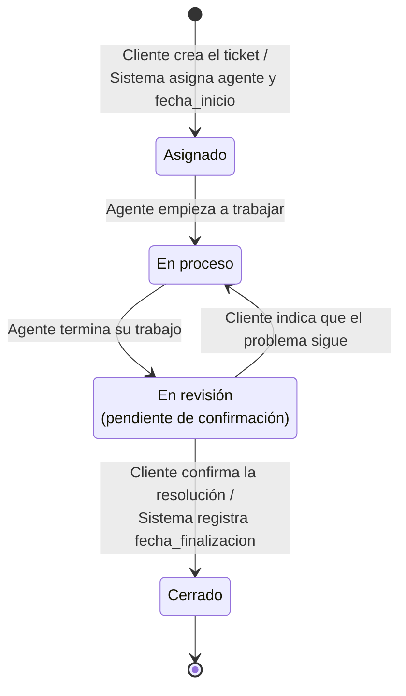

# Diagrama de Transición de Estado — Ticket

Herramienta: **Mermaid** (`stateDiagram-v2`). Modela el ciclo de vida de un ticket, desde que el cliente lo crea hasta que confirma que su problema fue resuelto.

```mermaid
stateDiagram-v2
    [*] --> Asignado : Cliente crea el ticket /<br/>Sistema asigna agente y fecha_inicio
    Asignado --> EnProceso : Agente empieza a trabajar
    EnProceso --> EnRevision : Agente termina su trabajo
    EnRevision --> Cerrado : Cliente confirma la resolución /<br/>Sistema registra fecha_finalizacion
    EnRevision --> EnProceso : Cliente indica que el problema sigue
    Cerrado --> [*]

    EnProceso : En proceso
    EnRevision : En revisión<br/>(pendiente de confirmación)
```

## Estados

| Estado | Valor en la API | Quién lo pone | Significado |
|---|---|---|---|
| Asignado | `asignado` | Sistema | Estado inicial. El ticket ya tiene agente, que todavía no empezó a trabajarlo. |
| En proceso | `en_proceso` | Agente (o Cliente al reabrir) | El agente está trabajando en el problema. |
| En revisión | `en_revision` | Agente | El agente terminó; se espera que el cliente confirme si quedó resuelto. |
| Cerrado | `cerrado` | Cliente | Estado final. Se registra la fecha de finalización, que se usa para el tiempo promedio de resolución. |

## Transiciones

| Desde | Hacia | Quién | Evento | Acción del sistema |
|---|---|---|---|---|
| (inicio) | Asignado | Sistema | El cliente crea el ticket | Asigna agente al azar y guarda `fecha_inicio` |
| Asignado | En proceso | Agente | Empieza a trabajar el ticket | — |
| En proceso | En revisión | Agente | Termina su trabajo | — |
| En revisión | Cerrado | Cliente | Confirma que el problema fue resuelto | Guarda `fecha_finalizacion` |
| En revisión | En proceso | Cliente | Indica que el problema sigue | — |

## Eliminación

Además de este ciclo, el agente puede **eliminar** un ticket en cualquier estado (`DELETE /tickets/{id}`). No es un estado más: el ticket deja de existir y ya no aparece en las consultas ni en los reportes. Por eso no figura en el diagrama.

> El diagrama muestra el camino esperado. De acuerdo con el criterio de **validaciones mínimas** del alcance, la API solo controla que el estado sea uno de los cuatro valores válidos; no bloquea otras transiciones.
