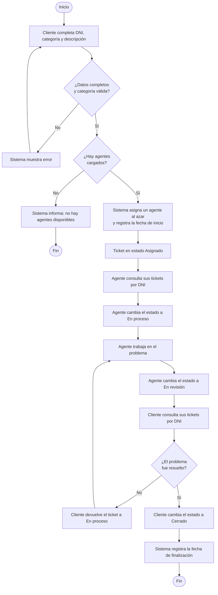

# Diagrama de Actividades

Responsable: Lucas

Herramienta: **Mermaid** (`flowchart`). Muestra el flujo completo de atención de un ticket, desde que el cliente lo crea hasta que se cierra, incluyendo las decisiones del camino.

