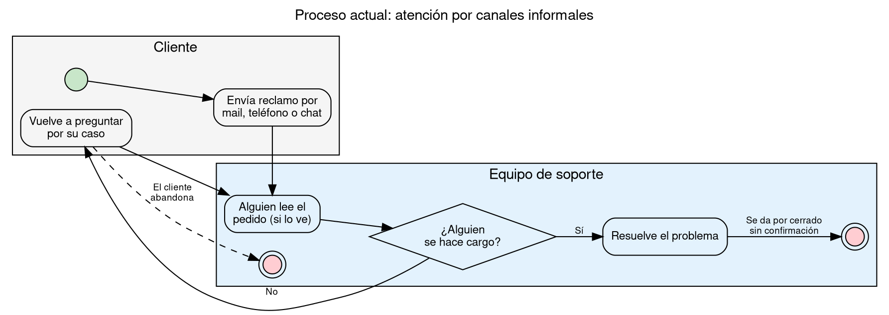
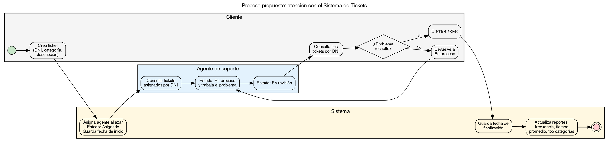

# Modelado del Proceso de Negocio

Responsable: Franco

Herramienta: **Graphviz** (visualizar en <https://dreampuf.github.io/GraphvizOnline>). Se modela el proceso **"Atención de un pedido de soporte"** con notación inspirada en BPMN: un carril (*lane*) por participante, eventos de inicio y fin (círculos), tareas (rectángulos redondeados) y compuertas de decisión (rombos).

## 1. Proceso actual (antes del sistema)

**Problemas visibles en el modelo:** nadie es responsable del pedido desde el inicio, el cliente tiene que volver a preguntar para saber el estado, el caso se cierra sin confirmación y no queda registro de fechas para medir tiempos.

## 2. Proceso propuesto (con el sistema)

## 3. Descripción del proceso propuesto

| # | Participante | Tarea | Resultado |
|---|---|---|---|
| 1 | Cliente | Crea el ticket con su DNI, la categoría y la descripción | Pedido registrado con formato común |
| 2 | Sistema | Asigna un agente al azar, pone el estado *Asignado* y guarda la fecha de inicio | Ningún pedido queda sin responsable |
| 3 | Agente | Consulta sus tickets por DNI | Sabe qué tiene pendiente |
| 4 | Agente | Pasa el ticket a *En proceso* y trabaja el problema | El cliente ve que su caso está siendo atendido |
| 5 | Agente | Pasa el ticket a *En revisión* | Queda pendiente de confirmación del cliente |
| 6 | Cliente | Consulta sus tickets y decide si el problema quedó resuelto | — |
| 7a | Cliente | Si está resuelto, cierra el ticket | El caso termina con confirmación del cliente |
| 7b | Cliente | Si no está resuelto, lo devuelve a *En proceso* | Vuelve al paso 4 |
| 8 | Sistema | Guarda la fecha de finalización | Se puede medir el tiempo de resolución |
| 9 | Sistema | Calcula los reportes | La empresa ve qué problemas se repiten y cuánto tardan |

## 4. Mejoras respecto del proceso actual

| Proceso actual | Proceso propuesto |
|---|---|
| Pedidos dispersos en mail, teléfono y chat | Un único punto de entrada: el ticket |
| Nadie es responsable hasta que alguien lo toma | Agente asignado automáticamente desde el inicio |
| El cliente tiene que volver a preguntar | El cliente consulta el estado por DNI cuando quiere |
| Se cierra sin confirmación | Solo el cliente cierra el ticket |
| Sin datos para mejorar | Reportes de frecuencia, tiempo promedio y top de categorías |
