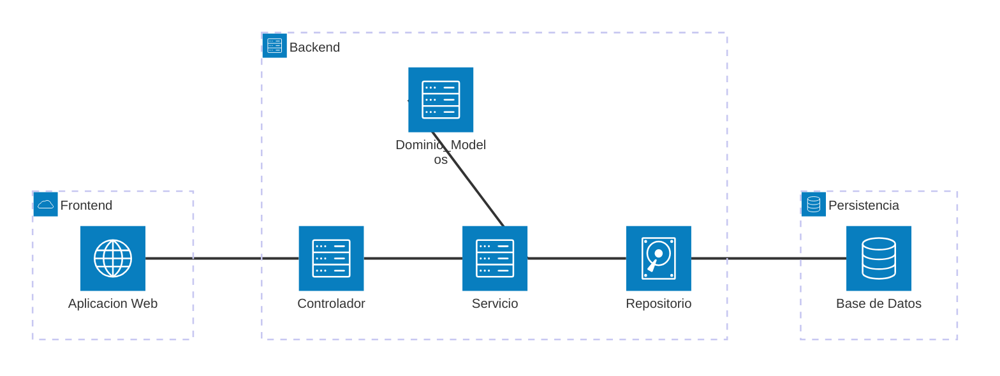

# Diseño de la Arquitectura General

Alcance: bloques del sistema y comunicación entre ellos. No incluye endpoints ni formato de request/response (`06_api.md`), tablas ni relaciones (ERD), ni framework, ORM o motor de base de datos (punto 4).

## Diagrama de Arquitectura

## Bloques

**Frontend.** Aplicación web independiente. Se comunica con el Backend exclusivamente vía HTTP/JSON. No accede a la Base de Datos.

**Controlador.** Recibe la petición HTTP. Valida su forma (presencia y tipo de los campos requeridos por el endpoint). Delega en el Servicio correspondiente. Arma la respuesta HTTP (código de estado + cuerpo).

**Servicio.** Un Servicio por recurso (`UsuarioService`, `TicketService`, `ComentarioService`, `ReporteService`). Orquesta el caso de uso: consulta al Repositorio a través de su interfaz, aplica las reglas de negocio que dependen del estado global del sistema, y delega en el Dominio las reglas propias de una entidad. Lanza una excepción de aplicación cuando una regla no se cumple.

**Dominio / Modelos.** Entidades: Usuario, Ticket, Comentario, Categoría. Cada entidad contiene las reglas que le son propias (ejemplo: `Ticket.puedeCambiarEstadoA(nuevoEstado)` determina las transiciones de estado válidas).

**Repositorio.** Un Repositorio por entidad, expuesto como interfaz (`UsuarioRepositorio`, `TicketRepositorio`, `ComentarioRepositorio`, `CategoriaRepositorio`). Operaciones: `existePorDni`, `buscarPorId`, `buscarPorDni`, `listar`, `guardar`, entre otras según el recurso. Devuelve y recibe instancias de Dominio, nunca filas crudas de la base. La implementación concreta de cada interfaz se define en el punto 4.

**Base de Datos.** Persiste usuarios, tickets, comentarios y categorías. Acceso exclusivo del Repositorio.

## Validación

- **Validación de forma**: Controlador. Presencia y tipo de los campos del request.
- **Validación de negocio**: Servicio y Dominio. Reglas que requieren el estado actual del sistema (unicidad de DNI, transición de estado válida, existencia del recurso).

El Controlador arma un objeto de entrada explícito para cada caso de uso a partir del body del request; no pasa el body crudo al Servicio ni al Dominio.

## Manejo de errores

| Tipo | Se origina en | Clase de código HTTP |
|---|---|---|
| Error de formato | Controlador | 4xx |
| Conflicto de negocio (DNI duplicado, transición de estado inválida) | Servicio / Dominio | 4xx |
| Recurso inexistente | Servicio | 4xx |
| Error no previsto | Cualquier capa | 5xx |

Un manejador central captura las excepciones de aplicación y las traduce a la respuesta HTTP. El formato del cuerpo de error se define en el punto 2 (API). Ninguna capa resuelve un error de negocio devolviendo `null` o un booleano: siempre se lanza una excepción de aplicación.

## Flujo de una petición

1. Controlador: recibe la petición, valida forma. Si falla, responde con error de formato.
2. Controlador: delega en el método del Servicio.
3. Servicio: consulta al Repositorio (interfaz) los datos que necesita.
4. Servicio: aplica reglas de negocio — las propias de una entidad vía Dominio, las de estado global directamente.
5. Si una regla falla: se lanza una excepción de aplicación, que llega sin intervención hasta el manejador central.
6. Si las reglas se cumplen: el Servicio construye o actualiza la entidad de Dominio y llama al Repositorio para persistir.
7. Controlador: recibe el resultado del Servicio, arma la respuesta HTTP.

Este flujo aplica a los nueve requerimientos funcionales de `04_requerimientos.md`. Lo que varía entre uno y otro son los pasos 3 y 4: qué Servicio, qué entidad de Dominio y qué regla puntual.

