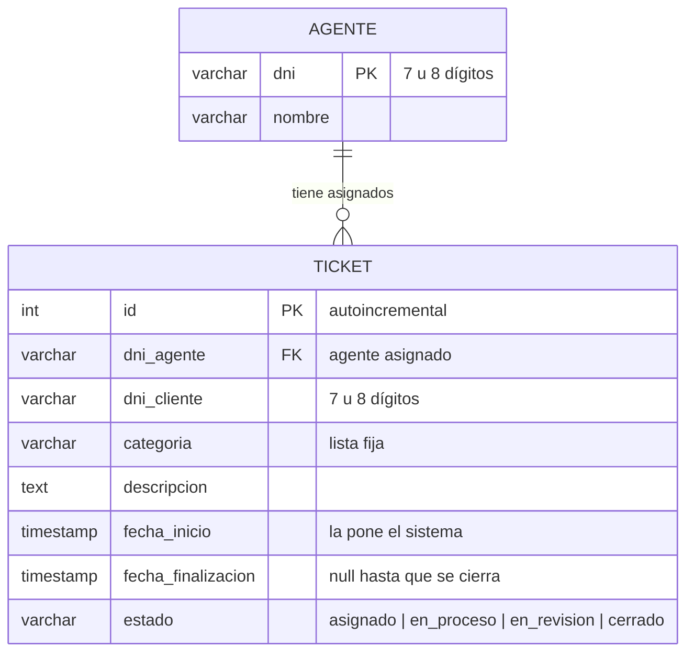

# Diseño de Datos (ERD)

Responsable: Lucas

El sistema usa **dos tablas**: `agente` y `ticket`. No hay tabla de clientes (el cliente se identifica solo con su DNI dentro del ticket) ni de categorías o estados (son listas fijas).

## Diagrama entidad-relación



## Relación

| Relación | Cardinalidad | Lectura |
|---|---|---|
| TICKET → AGENTE | 1 : 1 | Cada ticket tiene **exactamente un** agente asignado. |
| AGENTE → TICKET | 1 : N | Un agente puede tener **cero o muchos** tickets. |

## Tablas

### `agente`

| Campo | Tipo | Nulo | Clave | Descripción |
|---|---|---|---|---|
| `dni` | VARCHAR(8) | No | PK | DNI del agente. |
| `nombre` | VARCHAR(100) | No | | Nombre y apellido. |

### `ticket`

| Campo | Tipo | Nulo | Clave | Descripción |
|---|---|---|---|---|
| `id` | SERIAL | No | PK | Número de ticket, lo genera la base. |
| `dni_agente` | VARCHAR(8) | No | FK → `agente.dni` | Agente asignado automáticamente al crear el ticket. |
| `dni_cliente` | VARCHAR(8) | No | | DNI del cliente que reportó el problema. |
| `categoria` | VARCHAR(20) | No | | `conexion`, `facturacion`, `consulta_general` u `otro`. |
| `descripcion` | TEXT | No | | Qué ocurrió. |
| `fecha_inicio` | TIMESTAMP | No | | Momento en que se reportó. Por defecto, la fecha y hora actuales. |
| `fecha_finalizacion` | TIMESTAMP | Sí | | Momento en que el cliente cerró el ticket. |
| `estado` | VARCHAR(15) | No | | `asignado`, `en_proceso`, `en_revision` o `cerrado`. Por defecto `asignado`. |

## Script SQL (PostgreSQL)

Se puede importar en **drawDB** para obtener el diagrama, y es el mismo que usa el back-end para crear la base.

```sql
CREATE TABLE agente (
    dni     VARCHAR(8)   PRIMARY KEY CHECK (dni ~ '^[0-9]{7,8}$'),
    nombre  VARCHAR(100) NOT NULL
);

CREATE TABLE ticket (
    id                  SERIAL       PRIMARY KEY,
    dni_agente          VARCHAR(8)   NOT NULL REFERENCES agente (dni),
    dni_cliente         VARCHAR(8)   NOT NULL CHECK (dni_cliente ~ '^[0-9]{7,8}$'),
    categoria           VARCHAR(20)  NOT NULL
                        CHECK (categoria IN ('conexion', 'facturacion', 'consulta_general', 'otro')),
    descripcion         TEXT         NOT NULL CHECK (length(trim(descripcion)) > 0),
    fecha_inicio        TIMESTAMP    NOT NULL DEFAULT CURRENT_TIMESTAMP,
    fecha_finalizacion  TIMESTAMP    NULL,
    estado              VARCHAR(15)  NOT NULL DEFAULT 'asignado'
                        CHECK (estado IN ('asignado', 'en_proceso', 'en_revision', 'cerrado'))
);

CREATE INDEX idx_ticket_dni_cliente ON ticket (dni_cliente);
CREATE INDEX idx_ticket_dni_agente  ON ticket (dni_agente);

-- Seed: agentes precargados
INSERT INTO agente (dni, nombre) VALUES
    ('25987654', 'María Gómez'),
    ('28555111', 'Carlos Pérez'),
    ('31444222', 'Lucía Fernández');
```

## Consultas de los reportes

```sql
-- Frecuencia por categoría (las categorías sin tickets se completan con 0 en el servicio)
SELECT categoria, COUNT(*) AS cantidad
FROM ticket
GROUP BY categoria;

-- Tiempo promedio de resolución, en horas
SELECT AVG(EXTRACT(EPOCH FROM (fecha_finalizacion - fecha_inicio)) / 3600) AS promedio_horas,
       COUNT(*) AS tickets_cerrados
FROM ticket
WHERE estado = 'cerrado';

-- Top N categorías (N = 3 por defecto)
SELECT categoria, COUNT(*) AS cantidad
FROM ticket
GROUP BY categoria
ORDER BY cantidad DESC
LIMIT 3;
```
